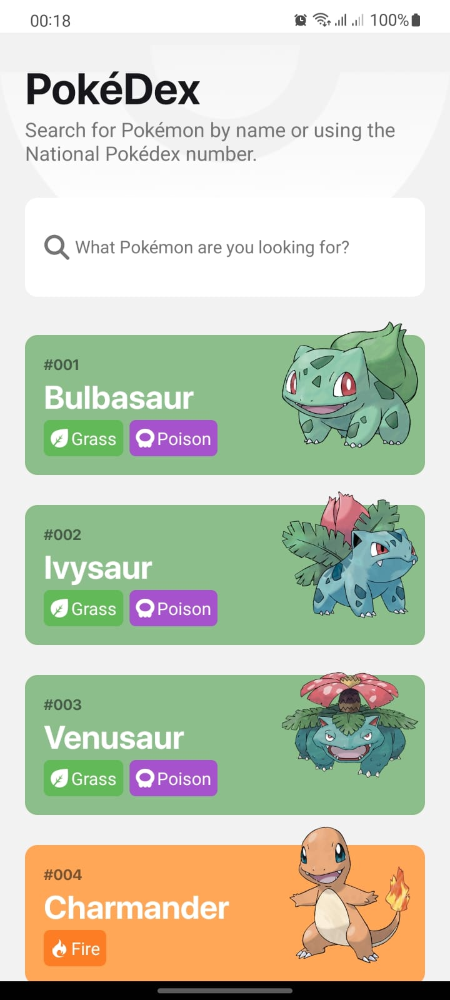
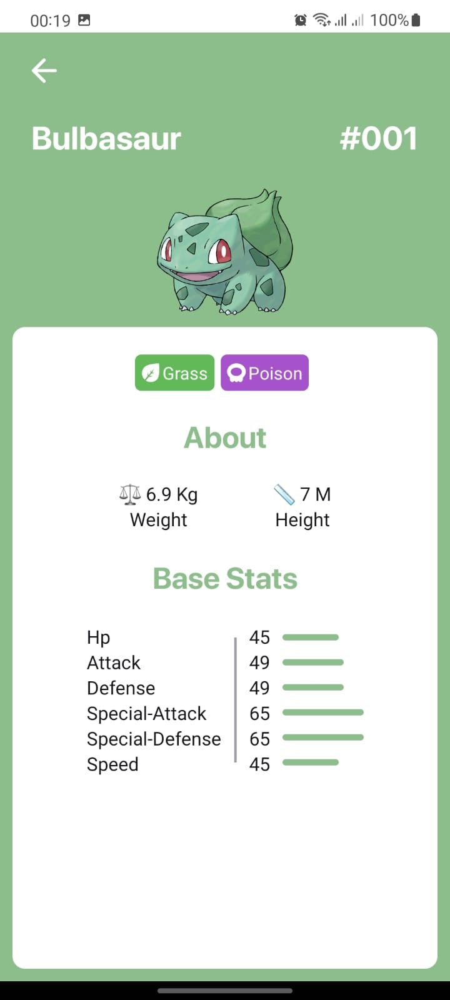
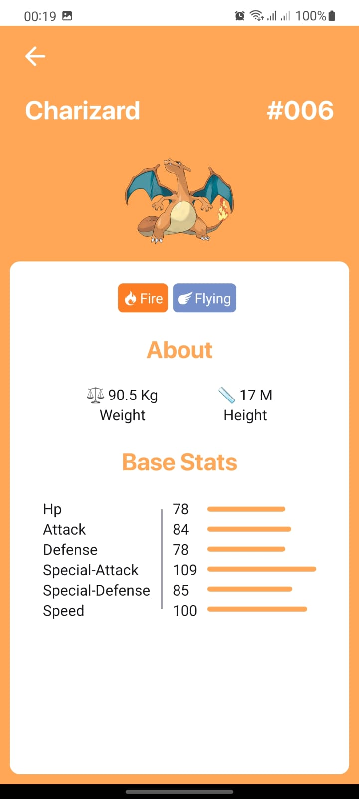
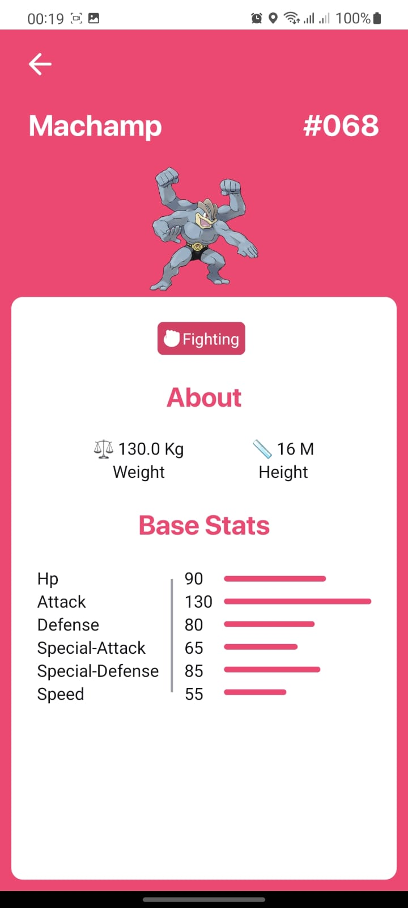

# PokedexApp - App

## Descrição
Um app desenvolvido com a tecnologia [React Native](https://reactnative.dev/), utilizando a API do [PokeApi](https://pokeapi.co/). Para
pesquisar seus pokemons favoritos. Uma interface moderna com um layout agradável, que pode ser acessada nesse link 
[Layout](https://www.behance.net/gallery/95727849/Pokdex-App?tracking_source=search_projects_recommended%7Cpokedex%20app). Esse App
precisa de conexão com a Internet para funcionar.

## Tecnologias Usadas
[React Native](https://reactnative.dev/)
[TypesCript](https://www.typescriptlang.org/)
[Styled-Components](https://styled-components.com/)
[React Navigation](https://reactnavigation.org/)
[Redux Toolkit](https://redux-toolkit.js.org/)

## Adendos Importantes
1. O layout citado foi apenas uma inspiração para criação do projeto.
2. Algumas funcionalidades do App não estão 100%, como a busca de Pokemons pela caixa de texto (TextInput), estou trabalhando
para que fique 100% logo 😁.

## Getting Started
1. Faça o download ou clone este repositório;
2. Abra seu Terminal/Prompt e navegue até o diretório PokedexApp;
3. Rode: **$ npm i** ou **$ yarn**
4. Rode: **$ npm android** ou **$ yarn android**;

## Imagens do Projeto

 
 
 
 
 

